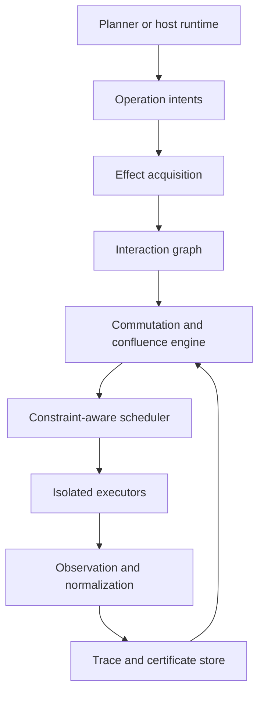

# Architecture

Agent Braid begins as a semantics and analysis layer. Execution is a separate responsibility that may be added only after the analysis artifacts are stable enough to consume.

## System context

## Components

### 1. Intent adapter

Converts host-specific plans, MCP calls, code-agent tasks, or recorded traces into canonical operation intents. It must preserve the original identity and payload hash without making the core dependent on the host runtime.

### 2. Effect acquisition

Combines four sources of evidence:

1. provider-declared metadata;
2. adapter or policy overrides;
3. static inference from code, plans, diffs, schemas, and dependencies;
4. effects observed during isolated execution.

Conflicts between sources are retained as evidence. Observation does not silently overwrite declaration.

### 3. Interaction graph

A versioned graph whose nodes are operation instances and resources. Edges encode at least:

- reads-from;
- writes-to;
- depends-on;
- conflicts-with;
- conditionally-commutes-with;
- commutes-with;
- compensates;
- precedes.

The graph is a diagnostic artifact and a scheduler input.

### 4. Analysis engine

Runs progressively stronger checks. A policy may stop at the cheapest sufficient level:

- effect-domain heuristics;
- file, range, and AST overlap;
- dependency and invariant analysis;
- transactional read/write validation;
- sandboxed schedule replay;
- normalization and observational comparison;
- proof-backed exchange or confluence rules.

### 5. Scheduler

Produces a partial order plus explicit constraints and an execution contract. It may propose parallelism through sound swaps or complete graph separation,
but must check enabledness, versions and contextual premises at use time. It must never label an untested ordering as safe solely because it is convenient.

### 6. Execution adapters

Potential adapters include local processes, containers, Git worktrees, MCP hosts, CI jobs, and distributed workers. Each adapter reports isolation strength and what effects remain outside its control.

### 7. Observer and normalizer

Defines meaningful equality for the workload. Examples include normalized repository trees, compilation and test outcomes, database constraints, external object versions, or event multisets. Normalizers are versioned because changing one changes the meaning of equivalence.

### 8. Trace and certificate store

Persists reproducible evidence. Certificates are content-addressed where possible and may refer to immutable artifacts rather than embedding sensitive state.

## Core data flow

1. Receive operation intents and initial state identity.
2. Resolve declared and inferred effect summaries.
3. Build the interaction graph and identify uncertainty.
4. Classify candidate pairs and higher-order interactions.
5. Generate a constrained schedule or request isolation.
6. Execute through adapters if runtime mode is enabled.
7. Observe, normalize, and compare relevant outcomes.
8. Emit traces, counterexamples, and certificates.
9. Feed observed discrepancies back into metadata and research corpora.

## Planned boundaries

| Boundary | Rule |
|---|---|
| Core ↔ model | Core semantics must not depend on a particular LLM. |
| Core ↔ protocol | MCP is an adapter, not the internal type system. |
| Analysis ↔ execution | Analysis can run read-only; execution requires an explicit adapter and policy. |
| Declaration ↔ observation | Both are preserved; mismatches are findings. |
| Equivalence ↔ normalization | Each certificate identifies both. |
| Practical ↔ mathematical | A useful conflict check is not automatically a braid or YB result. |

## Failure posture

When evidence is incomplete, the default outcome is `unknown`, not `commuting`. Policies may serialize unknown pairs. Destructive, externally visible, or non-idempotent effects require stronger evidence and explicit isolation or compensation semantics.

## Independent checking and commit boundary

Producer claims are distinct from consumer verification. A small checker binds
artifacts and recomputes supported finite results; it does not trust a level or
an LLM verdict. Real execution will require validation and commit within one
atomic/exclusive boundary. Adapters, normalizers and isolation remain explicit
trusted components. The lab is not that runtime and has no external adapter.

## Initial deployment shape

The first implementation should be a local, read-mostly CLI operating on declarative fixtures and Git worktrees. A library API follows once the core types stabilize. Remote execution, hosted control planes, and autonomous deployment are intentionally outside M0.
