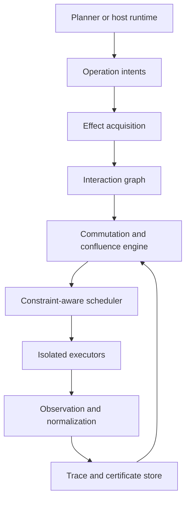

# Architecture

Agent Braid separates semantics and analysis from execution. The analyzer can run
without owning execution; the experimental local Git runtime consumes bounded
verified plans under an explicit operator policy and grants.

## Implemented boundary and planned extensions

| Capability | Current boundary | Specification |
|---|---|---|
| Analyzer and read-only Git adapter | Exact-resource effects, dependencies and conservative unknowns; no execution authority | [SPEC-003](specs/003-read-only-analyzer/spec.md), [SPEC-005](specs/005-git-worktree-adapter/spec.md) |
| Git laboratory | Isolated replay of fixed immutable commits, tracked-tree comparison and advisory preparation; M2 internally closed | [SPEC-012–017](specs/017-m2-closure/spec.md) |
| Structured exchange | Restricted `anchored-sequence-v1` producer/consumer and finite controls; M3 internally closed | [SPEC-018](specs/018-structured-exchange/spec.md) |
| Local Git runtime and stdio MCP | Owned private results, fixed text patches, policy/grants, isolated preparation, serial publication and process-interruption recovery | [SPEC-020](specs/020-m4-local-git-runtime/spec.md), [SPEC-021](specs/021-m4-alpha-runtime/spec.md) |
| Predictor preparation | Synthetic capture, recovery, accounting and filtered-lab tooling; real-source admission and fitting remain gated | [SPEC-019](specs/019-native-predictor/implementation-readiness.md) |
| Runtime utility and refinement preparation | Full-cost instrumentation and registered synthetic capture completed on `b85f7e5` (88 valid pairs; negative independent diagnostics); read-only refinement assessments and bounded NO-GO/defer decisions recorded. Owner accepted the bounded utility interpretation (item 21) and whole-M4 engineering/evaluation completion with negative utility (item 22); no deferred capability adopted | [SPEC-022](specs/022-m4-utility-followup/successor-protocol-180m.md), [SPEC-027](specs/027-runtime-refinement-contracts/quickstart.md) |
| System 1 reference core | Opt-in standard-library synthetic decisions and diagnostics; no learned model, accepted utility or execution authority | [SPEC-028](specs/028-system-one-core/spec.md) |
| Real-workload evaluation | Exact source rights/protocol, stable harness review and separate capture authorization bound to candidate `e66f9a1`; registered capture completed with 20 valid treatments and mandatory fresh verification. Six measured serial/parallel ratios were below one in this finite two-operation frame; checks compare tracked Git trees only. No real-source interruption/recovery controls; owner accepted bounded whole-M4 engineering/evaluation completion with negative utility on 2026-10-09 | [SPEC-038](specs/038-m4-real-workload-closure/implementation-readiness.md) · [capture summary](specs/038-m4-real-workload-closure/evidence/registered-capture-summary-e66f9a1.json) |
| Proposed Codex and Claude Code integrations | Draft shared MCP adapter, five product skills, package lifecycle and evidence presentation; implementation, host observations and ADR adoption remain pending | [M4.5 / SPEC-039–044](docs/tooling/README.md) |
| Further research and product capabilities | Recorded-trace, effectful-lab, formal-research, adoption, System 1 and forecast programmes; broader feature acceptance remains gated | [SPEC-023–026 and SPEC-029–037](docs/development/SPEC_MILESTONE_INDEX.md) |

The owner accepted bounded M4 alpha engineering and evaluation as complete with
negative utility on 2026-10-09. The [founder decision](specs/038-m4-real-workload-closure/whole-m4-founder-decision-20261009.json)
records the scope and limits; current tracking is visible in the [M4 milestone](https://github.com/jayanez/agent-braid/milestone/6).
The recorded [G4 NO-GO](specs/021-m4-alpha-runtime/g4-decision.json)
did not accept a useful speedup capability under its frozen evidence. Parallel
preparation does not authorize concurrent publication or arbitrary repository-code
execution. Source-ref promotion, real external effects, broader adapters and learned
advice require their own contracts, evidence and authority.

The proposed M4.5 adapter delegates bounded execution and recovery to the existing
runtime and operator grant policy. Its SDK dependency is planned as an optional
extra; core dependencies remain unchanged. Product skills are planned separately
from the generated Spec Kit contributor adapters. See the proposed
[ADR 0021](docs/adr/0021-codex-claude-tooling-integration.md) for the architecture
and adoption decisions still required.

The components and data flow below describe the reference architecture. Their
general mechanisms and example domains are design targets; current support is
limited to the versioned contracts and boundaries above.

## System context

```mermaid
flowchart TD
    P["Planner or host runtime"] --> I["Operation intents"]
    I --> E["Effect acquisition"]
    E --> G["Interaction graph"]
    G --> V["Commutation and confluence engine"]
    V --> Q["Constraint-aware scheduler"]
    Q --> X["Isolated executors"]
    X --> O["Observation and normalization"]
    O --> K["Trace and certificate store"]
    K --> V
```

## Components

### 1. Intent adapter

Converts host-specific plans, MCP calls, code-agent tasks, or recorded traces into canonical operation intents. It must preserve the original identity and payload hash without making the core dependent on the host runtime.

### 2. Effect acquisition

Combines four sources of evidence:

1. provider-declared metadata;
2. adapter or policy overrides;
3. static inference from code, plans, diffs, schemas, and dependencies;
4. effects observed during isolated execution.

Conflicts between sources are retained as evidence. Observation does not silently overwrite declaration.

### 3. Interaction graph

A versioned graph whose nodes are operation instances and resources. Edges encode at least:

- reads-from;
- writes-to;
- depends-on;
- conflicts-with;
- conditionally-commutes-with;
- commutes-with;
- compensates;
- precedes.

The graph is a diagnostic artifact and a scheduler input.

### 4. Analysis engine

Runs progressively stronger checks. A policy may stop at the cheapest sufficient level:

- effect-domain heuristics;
- file, range, and AST overlap;
- dependency and invariant analysis;
- transactional read/write validation;
- sandboxed schedule replay;
- normalization and observational comparison;
- proof-backed exchange or confluence rules.

### 5. Scheduler

Produces a partial order plus explicit constraints and an execution contract. It may propose parallelism through sound swaps or complete graph separation,
but must check enabledness, versions and contextual premises at use time. It must never label an untested ordering as safe solely because it is convenient.

### 6. Execution adapters

Potential adapters include local processes, containers, Git worktrees, MCP hosts, CI jobs, and distributed workers. Each adapter reports isolation strength and what effects remain outside its control.

### 7. Observer and normalizer

Defines meaningful equality for the workload. Examples include normalized repository trees, compilation and test outcomes, database constraints, external object versions, or event multisets. Normalizers are versioned because changing one changes the meaning of equivalence.

### 8. Trace and certificate store

Persists reproducible evidence. Certificates are content-addressed where possible and may refer to immutable artifacts rather than embedding sensitive state.

## Core data flow

1. Receive operation intents and initial state identity.
2. Resolve declared and inferred effect summaries.
3. Build the interaction graph and identify uncertainty.
4. Classify candidate pairs and higher-order interactions.
5. Generate a constrained schedule or request isolation.
6. Execute through adapters if runtime mode is enabled.
7. Observe, normalize, and compare relevant outcomes.
8. Emit traces, counterexamples, and certificates.
9. Feed observed discrepancies back into metadata and research corpora.

## Architecture boundaries

| Boundary | Rule |
|---|---|
| Core ↔ model | Core semantics must not depend on a particular LLM. |
| Core ↔ protocol | MCP is an adapter, not the internal type system. |
| Analysis ↔ execution | Analysis can run read-only; execution requires an explicit adapter and policy. |
| Declaration ↔ observation | Both are preserved; mismatches are findings. |
| Equivalence ↔ normalization | Each certificate identifies both. |
| Practical ↔ mathematical | A useful conflict check is not automatically a braid or YB result. |

## Failure posture

When evidence is incomplete, the default outcome is `unknown`, not `commuting`. Policies may serialize unknown pairs. Destructive, externally visible, or non-idempotent effects require stronger evidence and explicit isolation or compensation semantics.

## Independent checking and commit boundary

Producer claims are distinct from consumer verification. A small checker binds
artifacts and recomputes supported finite results; it does not trust a level or
an LLM verdict. The bounded Git runtime uses POSIX coordinator ownership and
sealed policy/manifests within its owned private store; these checks cover only
its documented fixed-patch execution contract. Broader execution adapters still
require their own validated, atomic/exclusive commit boundary. Adapters,
normalizers and isolation remain explicit trusted components. The laboratory
does not itself authorize execution or provide a real external-effect adapter.

## Initial deployment shape

The initial M0 deployment targeted a local, read-mostly CLI operating on
declarative fixtures and Git worktrees. The current package also exposes a Python
library and the opt-in local Git runtime described above. The
[owned runtime tutorial](examples/runtime/README.md) and
[alpha quickstart](specs/021-m4-alpha-runtime/quickstart.md) exercise that bounded
deployment. Hosted control planes, arbitrary repository-code execution and real
database/API/deploy effects remain planned extensions with separate admission
contracts; the original M0 scope did not authorize them.
