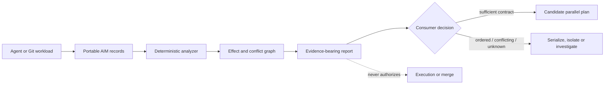

# Agent Braid

<p align="center">
  
</p>

<p align="center"><strong>Portable, evidence-carrying concurrency analysis for multi-agent systems.</strong></p>

Agent Braid is an open research and engineering project for deciding which
multi-agent operations may be candidates for parallel execution, which must be
ordered or isolated, and what evidence supports that conclusion. It turns
declared effects, dependencies, versions and observations into deterministic,
machine-readable interaction reports without executing agents or mutating their
resources.

The project is deliberately conservative: incomplete or ambiguous evidence
produces `unknown`, and no analysis result grants permission to execute,
parallelize or merge work.

## Why Agent Braid?

Agent frameworks can orchestrate concurrent work, and observability systems can
record what happened. A separate question remains: **which operations may safely
overlap, under which assumptions, and how can another consumer inspect the basis
for that decision?**

Agent Braid explores that gap through:

- **portable interaction metadata** rather than provider-specific semantics;
- **evidence-bearing classifications** with explicit assumptions and limits;
- **conservative defaults** for partial footprints and external effects;
- **reproducible finite checks** separated from formal proof and human approval;
- **a falsifiable research programme** for confluence, exchange operators and
  possible Yang–Baxter-type structure.

If the mathematical hypothesis fails outside restricted classes, the practical
analyzer must remain useful. The mathematics is a research direction, not a
premise hidden inside the product.

## What works today

Agent Braid is `0.1.0-alpha`. The current implementation requires Python 3.12,
uses only the standard library at runtime and provides three read-only commands:

| Command | Current capability |
|---|---|
| `agent-braid analyze <aim.json>` | Classify pairwise interactions in AIM `0.2.0-draft` records and emit JSON or text. |
| `agent-braid verify <certificate.json>` | Verify a bounded certificate bundle against its finite evidence. |
| `agent-braid analyze-git <request.json>` | Observe stable local commit/worktree snapshots and produce an analysis plus a separate provenance artifact. |

The repository also contains versioned schemas, positive and negative fixtures,
a bounded schedule laboratory, Git benchmarks, scientific controls and frozen
milestone evidence. There is no production scheduler or runtime yet.

## Quick start

Clone the repository and create an isolated environment:

```bash
git clone https://github.com/jayanez/agent-braid.git
cd agent-braid
python3.12 -m venv .venv
.venv/bin/python -m pip install --editable .
```

Analyze the included pair of file-edit operations:

```bash
.venv/bin/agent-braid analyze examples/analysis/file-edits.json --format text
```

The example currently reports the pair as `independent-candidate`, records the
constraint `requires-execution-contract-before-parallelism`, and sets execution
authorization to `false`.

Verify a finite replay certificate:

```bash
.venv/bin/agent-braid verify examples/contracts/0.2.0-draft/replay.json
```

Explore all CLI options with:

```bash
.venv/bin/agent-braid --help
```

The Git adapter additionally requires Git and an explicit
`--provenance-output <artifact.json>` path. Its accepted architecture and
observation boundary are documented in
[ADR 0008](docs/adr/0008-read-only-git-worktree-adapter.md).

## Reading an analysis

The alpha analysis contract uses four classifications:

| Classification | Meaning within the observed domain |
|---|---|
| `independent-candidate` | Complete exact-resource footprints show no write conflict; an execution contract is still required. |
| `ordered` | An explicit dependency path requires an order. |
| `conflicting` | A shared exact resource has at least one write-like effect. |
| `unknown` | Coverage or adapter semantics are insufficient for a stronger result. |

Every report binds its inputs, states the rule set and evidence method, preserves
constraints such as point-of-use version checks, and explicitly denies execution
authorization. The contract is defined in
[`schemas/0.1.0-alpha/analysis-report.schema.json`](schemas/0.1.0-alpha/analysis-report.schema.json).

## How it fits together



An action is modeled as an operation over state with declared, inferred or
observed effects. Separate layers handle representation, analysis, scheduling,
execution and evidence; a conclusion at one layer cannot silently authorize the
next.

## Scientific contract

The [Constitution](CONSTITUTION.md) is the project's sole normative authority.
Its clause zero is non-negotiable:

> Agent Braid does not assume that Yang–Baxter applies to AI agents. It exists to investigate whether useful classes of agent interactions can be given an algebraic structure in which braid relations, confluence, and eventually Yang–Baxter-type conditions emerge as verifiable properties.

Current evidence consists of bounded models, finite schedule enumeration,
replay checks, synthetic corpora, negative controls and internally reproduced
milestone records. It does **not** establish:

- production safety or permission to run operations concurrently;
- complete discovery of semantic or hidden dependencies;
- general confluence or contextual equivalence;
- correctness of future provider adapters;
- a general Yang–Baxter result;
- independent external validation.

Claims are labeled and reviewed as analogy, hypothesis, heuristic, empirical,
exhaustive-finite or formal results. See the
[claim discipline](docs/theory/CLAIM_DISCIPLINE.md),
[operational semantics](docs/theory/OPERATIONAL_SEMANTICS.md) and
[scientific integration](docs/theory/SCIENTIFIC_INTEGRATION.md).

## Project status

| Milestone | Status | Established boundary |
|---|---|---|
| M0 — foundation | Closed internally | Canonical semantics, contracts, governance and bounded laboratory. |
| M0.5 — open strategy | Closed internally | Research-preview proposal prepared and approved; publication is not authorized. |
| M1 — analyzer | Closed internally | Deterministic AIM analysis and experimental read-only Git/worktree adapter. |
| M2 — confluence laboratory and scheduler | Next | Reproducible certificates, partial-order reduction and safe planning under explicit contracts. |

Independent validation remains **pending**. The evidence has been reproduced
internally and reviewed by the founder, who has an explicit conflict of interest;
it has not been externally validated. Third parties are invited to follow the
published protocols. See the [validation policy](docs/releases/VALIDATION_POLICY.md),
[M0 closure](docs/releases/M0_CLOSURE.md),
[M0.5 closure](docs/releases/M0_5_CLOSURE.md) and
[M1 closure](docs/releases/M1_CLOSURE.md).

The repository has not been published as a research preview. The approved
[proposal](docs/releases/RESEARCH_PREVIEW_PROPOSAL.md) requires a clean export
because redistribution of one historical private report derivative remains
unresolved; it does not authorize a visibility change or history rewrite.

## Assurance compatibility classes

| Level | Name | Typical evidence |
|---:|---|---|
| 0 | Heuristic | Naming, file boundaries or model estimates |
| 1 | Syntactic | Non-overlapping text or AST regions |
| 2 | Semantic | Dependency and invariant analysis |
| 3 | Transactional | Declared and observed read/write/effect sets |
| 4 | Confluence | Scoped confluence claim with explicit method and domain |
| 5 | Yang–Baxter | Defined exchange operators satisfy the stated YB-like condition |

These labels are compatibility classes, not a universal strength ladder. Every
result must separately state its property, evidence method, domain, assumptions,
observation and execution contracts, and consumer verification status. No level
constitutes proof by itself or grants execution authority.

## Documentation map

| Start here for… | Document |
|---|---|
| Normative obligations | [Constitution](CONSTITUTION.md) |
| Architecture and boundaries | [Architecture](ARCHITECTURE.md) and [ADRs](docs/adr/) |
| AIM and certificate contracts | [AIM](docs/architecture/AGENT_INTERACTION_METADATA.md), [Confluence Certificate](docs/architecture/CONFLUENCE_CERTIFICATE.md) and [draft 0.2](docs/architecture/DRAFT_0_2.md) |
| Research questions and foundations | [Research programme](RESEARCH.md) and [Mathematical foundations](MATHEMATICAL_FOUNDATIONS.md) |
| Bounded executable experiments | [Laboratory](research/lab/README.md) and [experiment protocol](docs/experiments/PROTOCOL.md) |
| Product direction | [Open-tooling strategy](docs/strategy/OPEN_TOOLING_STRATEGY.md), [ecosystem map](docs/strategy/ECOSYSTEM.md) and [roadmap](ROADMAP.md) |
| Reproduction and release claims | [Release records](docs/releases/) and [validation policy](docs/releases/VALIDATION_POLICY.md) |
| Terminology | [Canonical terminology](TERMINOLOGY.md) |

## Repository map

```text
.
├── agent_braid/          # read-only alpha analyzer and Git adapter
├── docs/                 # architecture, ADRs, releases, strategy and theory
├── examples/             # positive, negative and portable workload fixtures
├── research/             # laboratory, benchmarks, hypotheses and radar
├── schemas/              # versioned public data contracts
├── scripts/              # deterministic validation and evidence tooling
├── specs/                # Spec Kit feature and assurance records
├── CONSTITUTION.md       # sole normative authority
└── ROADMAP.md            # evidence-gated technical milestones
```

## Contributing

Contributions are welcome across concurrency control, distributed systems,
programming-language semantics, formal methods, Git internals, interoperability,
benchmarks, counterexamples and precise documentation.

Start with [CONTRIBUTING.md](CONTRIBUTING.md). Contributors using Codex or Claude
Code follow the same [Spec Kit workflow](docs/development/SPEC_KIT.md) and shared
normative controls; neither agent has authority to alter the Constitution,
approve evidence or publish changes.

Use proportional validation while developing, then run the complete candidate gate
once before proposing a change:

```bash
python3 scripts/validate_change.py --base develop --profile quick
python3 scripts/validate_change.py --base develop --profile pr
```

Sensitive and previously unknown paths fail closed to stronger validation. See the
[validation profiles](docs/development/VALIDATION_PROFILES.md) for the path map,
specialist gates and clean-room boundary.

Use [SECURITY.md](SECURITY.md) for vulnerability-reporting guidance. Do not put
credentials, proprietary traces, personal data or live exploit details in a
public issue.

## Citation

If Agent Braid informs published work, cite the repository and the relevant
release or frozen evidence record. Machine-readable metadata is available in
[`CITATION.cff`](CITATION.cff).

## Licensing and project identity

Copyright © 2026 Juan Antonio Yáñez García.

Agent Braid uses a split-license model:

- software, schemas, executable examples and automation are licensed under
  [`AGPL-3.0-only`](LICENSES/AGPL-3.0-only.txt);
- documentation and research are licensed under
  [`CC-BY-SA-4.0`](LICENSES/CC-BY-SA-4.0.txt).

See [`LICENSE`](LICENSE) for the exact path mapping and [`NOTICE`](NOTICE) for
foundational attribution. These licenses do not grant rights to present an
unofficial fork, product or service as Agent Braid. Truthful referential use
remains permitted under the [trademark policy](TRADEMARKS.md).
