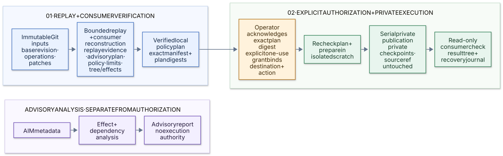

# Agent Braid

<p align="center">
  
</p>

<p align="center"><strong>Make concurrency decisions inspectable. Carry the evidence forward.</strong></p>

<p align="center">
  <a href="https://github.com/jayanez/agent-braid/actions/workflows/validate.yml"></a>
  <a href="pyproject.toml"></a>
  <a href="ROADMAP.md"></a>
  <a href="LICENSE"></a>
</p>

Agent Braid is an open research and engineering toolkit for **analyzing agent
effects, replaying Git changes and verifying bounded local execution**. It turns
declared dependencies, resource footprints and immutable inputs into portable
reports another consumer can reconstruct.

The analyzer is advisory. The opt-in policy pipeline requires a separately issued,
one-use operator grant and publishes into private local storage. Runtime
dependencies: **Python's standard library**. Git workflows additionally require
Git; execution requires Linux or macOS with POSIX locking.

**[Quick start](#-quick-start) · [CLI reference](#-cli-reference) ·
[Owned runtime demo](examples/runtime/README.md) · [Planned AI tooling](docs/tooling/README.md) · [Architecture](ARCHITECTURE.md) ·
[Evidence and status](#-evidence-and-project-status) · [Documentation](#-documentation)**

<a id="what-you-can-do"></a>

## ✨ What you can do

| Capability | Working surface | What the evidence covers |
| --- | --- | --- |
| **Inspect agent interactions** | AIM analyzer, effect graph and JSON/text reports | Exact-resource conflicts, dependency order and conservative `unknown` results. |
| **Replay changes before execution** | Read-only Git adapter, replay verifier and advisory preparation waves | Every admissible order of **2–4 immutable commits**, under the declared tracked-tree observation. |
| **Check structured exchanges** | `anchored-sequence-v1` producer and consumer | Context-dependent insert residuals, retained intermediate paths and bounded braid-relation controls. |
| **Run an owned Git pipeline** | Verified policy plans, local grants, isolated preparation and serial publication | Fixed text patches, checked paths/modes/blobs, private results and process-interruption resume/abort. |
| **Connect through stdio MCP** | Six bounded tools: `analyze`, `prepare`, `status`, `execute`, `recover`, `verify` | Configured source/result roots and the same local policy; grant issuance stays with the operator. |
| **Prepare prospective M3.5 studies** | Hidden-proposal journals, complete session/pair accounting, filtered labs and aggregate seals | Synthetic software checks. **Zero admitted real pairs**; source rights, exact protocol approval, capture and training remain gated. |
| **Inspect local System 1 decisions** | Opt-in `system-one` diagnostics with a standard-library reference backend | Synthetic requests only; no learned model, calibration, accepted utility or execution authority. |

The runtime executes allowlisted Git plumbing. Repository code, source-ref
promotion and broader agent/provider adapters require additional contracts and
authority. The [runtime demo](examples/runtime/README.md) gives you a complete
owned fixture; the [alpha quickstart](specs/021-m4-alpha-runtime/quickstart.md)
covers grants, recovery and MCP configuration.

### Planned Codex and Claude Code integrations

[M4.5](docs/tooling/README.md) is the next integration program, now Open, adjacent
to M4. Its six draft specs cover a shared MCP interface, five workflow skills,
reusable installation and diagnostics, chat explanations, interaction graphs and
offline evidence exports. The intended journey takes a developer from analyzing
proposed work to planning, executing an already granted bounded batch, recovering
an interruption and inspecting the verified result.

The first targets are **Codex local CLI and Claude Code local CLI**. Product
implementation, actual host observations and acceptance remain pending. Cursor,
VS Code/GitHub Copilot, OpenCode and pi are future routes. Start with the
[integration guide](docs/tooling/README.md) for the spec, contract and task map.

<a id="quick-start"></a>

## 🚀 Quick start

Requires **Python 3.12+**. The analyzer and decision diagnostics use the Python
standard library. Git analysis/replay and the owned runtime also require Git;
private runtime execution is supported on Linux and macOS with POSIX file locking.
Install from source in an isolated environment:

```bash
git clone https://github.com/jayanez/agent-braid.git
cd agent-braid
python3 -m venv .venv
.venv/bin/python -m pip install --editable .
```

Analyze two included file-edit operations:

```bash
.venv/bin/agent-braid analyze examples/analysis/file-edits.json --format text
```

The relevant output is:

```text
Operations: 2  Pairs: 1
edit-readme / edit-roadmap: independent-candidate
  - Complete exact-resource footprints are disjoint.
  constraints: requires-execution-contract-before-parallelism
Execution authorization: false
```

Verify a finite replay certificate and explore the commands:

```bash
.venv/bin/agent-braid verify examples/contracts/0.2.0-draft/replay.json
.venv/bin/agent-braid --help
```

The certificate reports `verified` for two checked schedules under its stated
finite observation. Analysis and certificate verification grant no execution
permission.

**Next:** follow the [owned Git tutorial](examples/runtime/README.md) to create
two independent commits, replay them, inspect a policy, issue an exact-digest
grant and verify the resulting private tree. It needs no model, API key or
development dependency.

<a id="from-analysis-to-a-verified-private-result"></a>

## 🔀 From analysis to a verified private result



[Open the editable Mermaid source](reports/assets/agent-braid-private-result-flow.mmd).

The advisory AIM report remains separate from the bounded Git replay path. A
consumer reconstructs replay, policy and tree claims before an operator grants
the exact plan digest. The runtime rechecks the plan, prepares in isolated
scratch and publishes checkpoints serially to a private result repository. The
checked result includes runtime state and a recovery journal; no source ref is
published. Producer and consumer share reference implementations, so
reconstruction is not independently implemented semantics.

<a id="reading-an-analysis"></a>

### Reading an analysis

A report describes evidence about the inputs and declared effects it actually
observed. `independent-candidate` means complete exact-resource footprints show
no write conflict in that domain; an execution contract is still required.
`ordered` records an explicit dependency path. `conflicting` means a shared
exact resource has a write-like effect. `unknown` means coverage or adapter
semantics do not justify a stronger result. None is an execution verdict.

Reports bind inputs, name the rule set and method, retain assumptions and
point-of-use constraints, and set `executionAuthorization: false`. See the
[analysis contract](schemas/0.1.0-alpha/analysis-report.schema.json) and
[AIM draft 0.2](docs/architecture/DRAFT_0_2.md).

<a id="cli-reference"></a>

## 🛠 CLI reference

The command surface is visible here; `agent-braid <command> --help` lists each
command's required artifacts, destinations and acknowledgements.

| Command | Purpose |
| --- | --- |
| `analyze`, `analyze-trace`, `analyze-git` | Analyze AIM records, explicitly mapped trace metadata, or stable Git snapshots with provenance. |
| `verify` | Verify a bounded certificate bundle. |
| `plan-git`, `verify-git`, `verify-plan` | Produce and reconstruct bounded Git replay evidence and advisory plans. |
| `prototype-git` | Compare isolated patch preparation with serial scratch integration in disposable state. |
| `propose-exchange`, `verify-exchange` | Produce and regenerate restricted anchored-sequence exchange evidence. |
| `prepare-git-run`, `execute-git-run`, `recover-git-run`, `verify-git-run` | Prepare, explicitly authorize, recover or verify the bounded local Git runtime. |
| `prepare-policy-run`, `verify-policy-plan`, `grant-policy-run`, `execute-policy-run`, `inspect-policy-run`, `recover-policy-run` | Prepare and reconstruct an operator policy, issue a digest-bound grant, then execute or inspect/recover the private result. |
| `system-one capabilities`, `system-one decide` | Inspect or run opt-in offline synthetic decision diagnostics. |

The analyzer/runtime contract is `0.1.0-alpha`; AIM and certificate contracts
are `0.2.0-draft`; the package version is `0.1.0a1`. The public CLI does not
expose source-ref promotion, arbitrary repository code execution, or provider
calls through the owned runtime.

<a id="evidence-and-project-status"></a>

## 🧭 Evidence and project status

**Project status on 2026-10-08:** research alpha. The source inventory includes
44 specs and 19 registered GitHub milestones.
SPEC-039–044 are draft planning packages with 60 unchecked implementation tasks;
M4.5 is Open with six spec issues and 60 linked task subissues. “Closed”
is the remote milestone state; internal closure, obtained implementation,
scientific acceptance and external review are separate facts. The
[spec and milestone index](docs/development/SPEC_MILESTONE_INDEX.md) lists every
current assignment.

| Track | Milestone | State and evidence boundary |
| --- | --- | --- |
| Foundations | [M0 — Operational foundations](https://github.com/jayanez/agent-braid/milestone/1) | Closed; internally closed. Independent external validation remains pending. |
| Foundations | [M0.5 — Open strategy and preview preparation](https://github.com/jayanez/agent-braid/milestone/2) | Closed; internally closed. Two historical review items remain open in tracking. |
| Foundations | [M1 — Observable interaction analyzer](https://github.com/jayanez/agent-braid/milestone/3) | Closed internally against the reviewed candidate; independent external validation remains pending. |
| Research | [M2 — Confluence lab and scheduler](https://github.com/jayanez/agent-braid/milestone/4) | Closed internally. Bounded replay and finite observations do not establish general confluence. |
| Research | [M3 — Braid semantics](https://github.com/jayanez/agent-braid/milestone/5) | Closed internally for `anchored-sequence-v1`; no general braid or Yang–Baxter theorem is claimed. |
| Runtime | [M4 — Agent Braid runtime](https://github.com/jayanez/agent-braid/milestone/6) | **Open.** The bounded alpha includes local grants, isolated preparation, stdio MCP and Linux reproduction; whole-milestone acceptance is pending. SPEC-021 G4 remains **NO-GO** on useful speedup under its frozen evidence. |
| Integration | [M4.5 — AI tooling integrations for Codex and Claude Code](https://github.com/jayanez/agent-braid/milestone/19) | **Open.** Six draft specs cover MCP, skills, lifecycle, presentation and evaluation. Product support and host evidence remain pending. |
| Publication | [PUB.1 — Public research preview](https://github.com/jayanez/agent-braid/milestone/7) | **Open.** The preview is public; historical publication authorization reconciliation remains separately tracked. |
| Governance | [GOV.1 — Governance and adoption](https://github.com/jayanez/agent-braid/milestone/8) | **Open.** Governance and adoption evidence work continues; issue state does not confer human or founder approval. |
| Research | [M3.5 — Native proposal predictor](https://github.com/jayanez/agent-braid/milestone/9) | **Open.** Synthetic capture and readiness tooling exist; zero real pairs are admitted. Rights, exact protocol/review, real capture and training remain gated. |
| Adoption | [ADP.1 — Recorded-trace adapters](https://github.com/jayanez/agent-braid/milestone/10) | **Open.** Generic synthetic metadata import and bounded lifecycle spikes provide engineering evidence; real-source admission and provider adoption remain pending. |
| Research | [LAB.1 — Effectful workload lab](https://github.com/jayanez/agent-braid/milestone/11) | **Open.** Contract and design work is in progress; no real external execution is authorized. |
| Research | [RES.1 — Formal interaction research](https://github.com/jayanez/agent-braid/milestone/12) | **Open.** Contextual and proof-obligation work remains bounded research; finite checking is not a proof of generality. |
| System 1 | [S1.0 — Decision contracts](https://github.com/jayanez/agent-braid/milestone/13) | **Open.** SPEC-028's standard-library synthetic reference core is implemented and technically reviewed; human review and feature acceptance remain pending. |
| System 1 | [S1.1 — Decision evaluation](https://github.com/jayanez/agent-braid/milestone/14) | **Open.** Prospective, permissioned corpus and evaluation gates are planned; no accepted utility claim. |
| System 1 | [S1.2 — Native decision model](https://github.com/jayanez/agent-braid/milestone/15) | **Open.** Model experiments remain gated by rights, feasibility and common evaluation; no learned model is accepted. |
| System 1 | [S1.3 — Advisory integration](https://github.com/jayanez/agent-braid/milestone/16) | **Open.** Integration remains advisory and gated by core evidence; no authority escalation. |
| System 1 | [S1.4 — Product capabilities and promotion](https://github.com/jayanez/agent-braid/milestone/17) | **Open.** Capability choices and promotion are separate decisions; no capability promotion is implied. |
| Forecasting | [FC.1 — Forecast-guided parallelism experiment](https://github.com/jayanez/agent-braid/milestone/18) | **Open.** Four forecast-program specs define permissioned telemetry, optional local forecasting and complete-cost experiments; no execution-domain expansion or utility acceptance. |

### Runtime and evidence boundaries

SPEC-021's historical study found equal verified trees in six paired trials,
with a median serial/parallel total-wall ratio of **0.5581**. In that small,
uncontrolled sample, serial execution took about 55.81% of parallel total wall
time. This is descriptive evidence, not a population estimate or a general
claim about parallelism. The [G4 decision](specs/021-m4-alpha-runtime/g4-decision.json)
remains authoritative.

SPEC-022 completed its registered synthetic capture on candidate `b85f7e5`:
88/88 valid pairs (8 warm-up, 80 measured; 176 treatments), with five blocks
excluded by pinned caps. Required in-treatment verification completed; fresh
inspection verified capture structure and bounded replay, and four fresh control
suites passed (76 tests). All three admitted independent diagnostic blocks were
negative; the dependency-chain block was an order control. These fixture results
do not establish general speedup or utility. See the [derived capture summary](specs/022-m4-utility-followup/evidence/registered-capture-summary-b85f7e5.json)
for ratios, full costs and inspection limits.

SPEC-027 has implemented read-only
refinement assessments and synthetic/disposable controls. The founder recorded
NO-GO/defer dispositions for source promotion, arbitrary code execution and real
external effects by the bounded M4 alpha runtime; no capability was adopted and no
expanded execution authority was granted. Whole-M4 and scientific acceptance remain
separate and pending. SPEC-038's historically reviewed candidate failed twice
before dispatch, so zero actual source treatments ran. Both failures are
preserved. Any repair requires a new stable candidate and source manifest, with
fresh exact owner review and capture authorization; approvals for the old
candidate do not carry forward. See the [attempt summary](specs/038-m4-real-workload-closure/evidence/pre-dispatch-attempt-summary.json).
SPEC-021 G4 remains NO-GO, and M4 remains open pending separate whole-milestone
acceptance. No actual-workload outcome has been obtained.

M3.5 synthetic checks demonstrate tooling only. They do not establish real-source
rights, prospective registration, capture, training authorization, predictor
benefit or scientific validation. See the [M3.5 readiness note](docs/development/m35-technical-readiness.md),
[Linux runbook](docs/development/linux-experiments.md), [M4 cost diagnostics](docs/development/M4_RUNTIME_COST_DIAGNOSTICS.md)
and [delivery record](docs/development/autonomous-delivery.md).

Historical internal closure records and their limits are in [release records](docs/releases/).
The founder reviewed those closures and has an explicit conflict of interest;
independent external validation remains pending. The [public cutover audit](docs/releases/publication/CUTOVER_AUDIT_2026-09-25.md)
tracks historical authorization reconciliation separately from repository
availability. For the complete future work inventory, see the [foundational
implementation portfolio](docs/development/FOUNDATION_IMPLEMENTATION_PORTFOLIO.md),
[System 1 program](specs/028-system-one-core/program.md), [forecast program](specs/034-workload-forecast-data/spec.md)
and [roadmap](ROADMAP.md).

<a id="scientific-contract"></a>

## 🧪 Scientific contract

The [Constitution](CONSTITUTION.md) is the sole normative authority. Agent Braid
takes inspiration from Yang–Baxter and braid theory to ask whether carefully
defined classes of agent interactions can support useful, verifiable exchange
properties. Each claim is earned by defining its objects, operators, equivalence,
domain and evidence. This work may reveal useful behavior without a
Yang–Baxter result; any theorem must remain within the structure and scope it proves.

Claims distinguish analogy, hypothesis, heuristic, empirical, exhaustive-finite
and formal results. Finite replay and structural checks support only their
declared domains; they establish neither production safety, hidden-effect
completeness, general confluence nor a general Yang–Baxter theorem. The six
assurance labels are [compatibility classes](docs/architecture/ASSURANCE_LEVELS.md),
with the property, method, observation and execution contract stated separately.

Start with [claim discipline](docs/theory/CLAIM_DISCIPLINE.md),
[operational semantics](docs/theory/OPERATIONAL_SEMANTICS.md) and
[structured exchange semantics](docs/theory/STRUCTURED_EXCHANGE.md).

<a id="documentation"></a>

## 📚 Documentation

| Your next step | Start here |
| --- | --- |
| Build and verify a local result | [Owned fixture tutorial](examples/runtime/README.md) · [Alpha runtime / MCP](specs/021-m4-alpha-runtime/quickstart.md) |
| Follow planned Codex and Claude Code support | [M4.5 integration guide](docs/tooling/README.md) · [Capability matrix](specs/039-ai-tooling-program/capability-matrix.md) |
| Understand architecture and limits | [Architecture](ARCHITECTURE.md) · [Git replay](docs/architecture/GIT_REPLAY.md) · [ADRs](docs/adr/) |
| Consume portable artifacts | [AIM](docs/architecture/AGENT_INTERACTION_METADATA.md) · [Certificates](docs/architecture/CONFLUENCE_CERTIFICATE.md) · [Schemas](schemas/) |
| Reproduce experiments | [Bounded laboratory](research/lab/README.md) · [Experiment protocol](docs/experiments/PROTOCOL.md) · [External reproduction](docs/releases/EXTERNAL_REPRODUCTION.md) |
| Prepare M3.5 sources | [Technical readiness](docs/development/m35-technical-readiness.md) · [Prospective pilot](specs/019-native-predictor/prospective-pilot.md) |
| Run Linux checks and inspect cost | [Linux execution](docs/development/linux-experiments.md) · [Cost diagnostics](docs/development/M4_RUNTIME_COST_DIAGNOSTICS.md) · [Delivery record](docs/development/autonomous-delivery.md) |
| Explore the research programme | [Research](RESEARCH.md) · [Mathematical foundations](MATHEMATICAL_FOUNDATIONS.md) · [References](research/REFERENCES.md) |
| Follow project direction | [Roadmap](ROADMAP.md) · [Implementation portfolio](docs/development/FOUNDATION_IMPLEMENTATION_PORTFOLIO.md) · [Open-tooling strategy](docs/strategy/OPEN_TOOLING_STRATEGY.md) · [Ecosystem](docs/strategy/ECOSYSTEM.md) |
| Contribute under the project rules | [Contributing](CONTRIBUTING.md) · [Governance](GOVERNANCE.md) · [Spec Kit](docs/development/SPEC_KIT.md) · [Terminology](TERMINOLOGY.md) |

<a id="contributing"></a>

## 🤝 Contributing

Work on bounded adapters, reproducible controls, counterexamples, interoperability,
concurrency semantics, Git internals or precise documentation. Follow
[CONTRIBUTING.md](CONTRIBUTING.md) and use isolated development dependencies:

```bash
.venv/bin/python -m pip install -r requirements-dev.txt -r requirements-speckit.txt
.venv/bin/python -m scripts.restore_public_spec_history
.venv/bin/python -m scripts.validate_spec_kit
.venv/bin/python -m scripts.validate_change --base develop --profile quick
.venv/bin/python -m scripts.validate_change --base develop --profile pr
```

Sensitive and unknown paths select stronger checks. Clean-room capture,
scientific review and founder decisions keep their separate gates; see
[validation profiles](docs/development/VALIDATION_PROFILES.md).
Use [SECURITY.md](SECURITY.md) for vulnerability reporting.

<details>
<summary><strong>Repository map</strong></summary>

```text
agent_braid/   Analyzer, Git replay, structured exchange, private runtime and MCP
docs/          Architecture, ADRs, operational guides, theory and release records
examples/      Portable fixtures, positive/negative controls and runtime tutorial
research/      Finite laboratory, hypotheses, benchmarks, counterexamples and radar
schemas/       Versioned machine-readable contracts
scripts/       Validation, capture, reproduction, profiling and tracking tools
specs/         Feature plans, frozen evidence, assurance and review records
```

</details>

<a id="citation-and-licensing"></a>

## 📄 Citation and licensing

Cite the relevant release or frozen evidence record alongside the repository;
machine-readable metadata is in [CITATION.cff](CITATION.cff).

Copyright © 2026 Juan Antonio Yáñez García. Software, schemas, executable examples
and automation use [AGPL-3.0-only](LICENSES/AGPL-3.0-only.txt); documentation and
research use [CC-BY-SA-4.0](LICENSES/CC-BY-SA-4.0.txt). The [license map](LICENSE),
[attribution notices](NOTICE) and [trademark policy](TRADEMARKS.md) define the
applicable terms and project identity.
