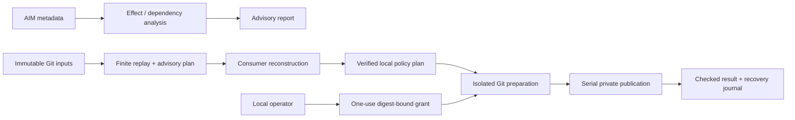

# Agent Braid

<p align="center">
  
</p>

<p align="center"><strong>Make concurrency decisions inspectable. Carry the evidence forward.</strong></p>

<p align="center">
  <a href="https://github.com/jayanez/agent-braid/actions/workflows/validate.yml"></a>
  <a href="pyproject.toml"></a>
  <a href="ROADMAP.md"></a>
  <a href="LICENSE"></a>
</p>

Agent Braid is an open research and engineering toolkit for **analyzing agent
effects, replaying Git changes and verifying bounded local execution**. It turns
declared dependencies, resource footprints and immutable inputs into portable
reports another consumer can reconstruct.

The analyzer is advisory. The opt-in policy pipeline requires a separately issued,
one-use operator grant and publishes into private local storage. Runtime
dependencies: **Python's standard library**. Git workflows additionally require
Git; execution requires Linux or macOS with POSIX locking.

**[Quick start](#quick-start) · [Owned runtime demo](examples/runtime/README.md) ·
[Architecture](ARCHITECTURE.md) · [Evidence and status](#evidence-and-project-status) ·
[Documentation](#documentation)**

## What you can do

| Capability | Working surface | What the evidence covers |
| --- | --- | --- |
| **Inspect agent interactions** | AIM analyzer, effect graph and JSON/text reports | Exact-resource conflicts, dependency order and conservative `unknown` results. |
| **Replay changes before execution** | Read-only Git adapter, replay verifier and advisory preparation waves | Every admissible order of **2–4 immutable commits**, under the declared tracked-tree observation. |
| **Check structured exchanges** | `anchored-sequence-v1` producer and consumer | Context-dependent insert residuals, retained intermediate paths and bounded braid-relation controls. |
| **Run an owned Git pipeline** | Verified policy plans, local grants, isolated preparation and serial publication | Fixed text patches, checked paths/modes/blobs, private results and process-interruption resume/abort. |
| **Connect through stdio MCP** | Six bounded tools: `analyze`, `prepare`, `status`, `execute`, `recover`, `verify` | Configured source/result roots and the same local policy; grant issuance stays with the operator. |
| **Prepare prospective M3.5 studies** | Hidden-proposal journals, complete session/pair accounting, filtered labs and aggregate seals | Synthetic software checks. **Zero admitted real pairs**; source/protocol approval and training remain pending. |

The runtime executes allowlisted Git plumbing. Repository code, source-ref
promotion and broader agent/provider adapters require additional contracts and
authority. The [runtime demo](examples/runtime/README.md) gives you a complete
owned fixture; the [alpha quickstart](specs/021-m4-alpha-runtime/quickstart.md)
covers grants, recovery and MCP configuration.

## Quick start

Requires **Python 3.12+**. Install from source in an isolated environment:

```bash
git clone https://github.com/jayanez/agent-braid.git
cd agent-braid
python3 -m venv .venv
.venv/bin/python -m pip install --editable .
```

Analyze two included file-edit operations:

```bash
.venv/bin/agent-braid analyze examples/analysis/file-edits.json --format text
```

The relevant output is:

```text
Operations: 2  Pairs: 1
edit-readme / edit-roadmap: independent-candidate
  - Complete exact-resource footprints are disjoint.
  constraints: requires-execution-contract-before-parallelism
Execution authorization: false
```

Verify a finite replay certificate and explore the commands:

```bash
.venv/bin/agent-braid verify examples/contracts/0.2.0-draft/replay.json
.venv/bin/agent-braid --help
```

The certificate reports `verified` for two checked schedules under its stated
finite observation. Analysis and certificate verification grant no execution
permission.

**Next:** follow the [owned Git tutorial](examples/runtime/README.md) to create
two independent commits, replay them, inspect a policy, issue an exact-digest
grant and verify the resulting private tree. It needs no model, API key or
development dependency.

## From analysis to a verified private result


```mermaid
flowchart LR
    A["AIM metadata"] --> B["Effect / dependency analysis"]
    B --> C["Advisory report"]
    G["Immutable Git inputs"] --> R["Finite replay + advisory plan"]
    R --> V["Consumer reconstruction"]
    V --> P["Verified local policy plan"]
    O["Local operator"] --> K["One-use digest-bound grant"]
    P --> W["Isolated Git preparation"]
    K --> W
    W --> S["Serial private publication"]
    S --> E["Checked result + recovery journal"]
```

Each layer carries its own inputs, observation and limits. Analysis cannot
silently authorize the next layer. Workers have private writable repositories
and indexes; one coordinator publishes checkpoints. The consumer regenerates
the relevant replay, policy and tree/effect checks instead of trusting a
producer's verdict. Producer and consumer share reference implementations;
independent consumption does not mean independently implemented semantics.

### Reading an analysis

| Classification | Meaning within the observed domain |
| --- | --- |
| `independent-candidate` | Complete exact-resource footprints show no write conflict; an execution contract is still needed. |
| `ordered` | An explicit dependency path requires an order. |
| `conflicting` | A shared exact resource has at least one write-like effect. |
| `unknown` | Coverage or adapter semantics do not support a stronger result. |

Reports bind inputs, name their rule set and method, retain assumptions and
point-of-use constraints, and set `executionAuthorization: false`. See the
[analysis contract](schemas/0.1.0-alpha/analysis-report.schema.json) and
[AIM draft 0.2](docs/architecture/DRAFT_0_2.md).

<details>
<summary><strong>CLI reference at a glance</strong></summary>

| Commands | Purpose |
| --- | --- |
| `analyze`, `verify` | Analyze AIM records and verify finite certificates. |
| `analyze-git` | Observe stable commit/worktree snapshots with an explicit provenance artifact. |
| `plan-git`, `verify-git`, `verify-plan` | Produce and independently reconstruct bounded Git replay and advisory plans. |
| `prototype-git` | Compare isolated patch preparation and serial integration in disposable state. |
| `propose-exchange`, `verify-exchange` | Produce and regenerate restricted anchored-sequence exchange evidence. |
| `prepare-policy-run`, `verify-policy-plan` | Prepare and reconstruct an opt-in serial/parallel policy. |
| `grant-policy-run` | Issue an operator-acknowledged grant outside the MCP tool path. |
| `execute-policy-run`, `inspect-policy-run`, `recover-policy-run` | Execute, inspect, resume or abort an owned result under the policy. |
| `prepare-git-run`, `execute-git-run`, `recover-git-run`, `verify-git-run` | Use or verify the first bounded serial-runtime contract. |

Use `agent-braid <command> --help` for required artifacts, destinations and
acknowledgements. Contracts are versioned: analyzer/runtime `0.1.0-alpha`,
AIM/certificate `0.2.0-draft`. Package metadata is `0.1.0a1`.

</details>

## Evidence and project status

| Milestone | Obtained | Boundary still open |
| --- | --- | --- |
| **M0–M1** | Operational foundation, governance, deterministic analyzer and read-only Git adapter; internally closed. | Independent external validation. |
| **M2** | Bounded Git replay, normalization/reduction experiments and consultative preparation; internally closed. | Broader observation/execution domains. |
| **M3** | Restricted anchored-sequence exchange experiment; internally closed. | General mathematical claims and external proof review. |
| **M3.5** | Synthetic capture, recovery, accounting, lab export and seal tooling. | Approved real sources, prospective registration, corpus, labels and predictor evaluation. |
| **M4** | Founder-accepted first serial increment; alpha grants, isolated preparation, stdio MCP, recorded Codex/Claude host exercises and Linux reproduction. | **Whole M4 remains open.** Founder G4 **NO-GO** on utility under the frozen evidence. |

The historical M4 experiment obtained equal verified trees in six paired trials
but a median serial/parallel total-wall ratio of **0.5581**. That small,
uncontrolled sample did not support accepting a useful speedup capability. The
[G4 decision](specs/021-m4-alpha-runtime/g4-decision.json) remains authoritative;
new optimizations and descriptive comparisons have their
[own engineering record](docs/development/autonomous-delivery.md).

Reproduction runs bind exact candidate commits and input hashes. Public Linux
experiments use owned synthetic fixtures and retain results in logs/job summaries;
private source permissions and prospective-window registration remain separate.
Follow the [Linux runbook](docs/development/linux-experiments.md),
[M3.5 readiness note](docs/development/m35-technical-readiness.md) and
[M4 cost diagnostics](docs/development/M4_RUNTIME_COST_DIAGNOSTICS.md).

The [research preview](https://github.com/jayanez/agent-braid/releases/tag/v0.1.0-alpha.1)
and [internal closure records](docs/releases/) preserve historical claims.
Historical milestone closures were produced internally and reviewed by the
founder, who has an explicit conflict of interest. Independent external validation
remains pending. The
[public cutover audit](docs/releases/publication/CUTOVER_AUDIT_2026-09-25.md)
records the outstanding authorization reconciliation separately from public
repository availability.

## Scientific contract

The [Constitution](CONSTITUTION.md) is the sole normative authority. Its clause zero:

> Agent Braid does not assume that Yang–Baxter applies to AI agents. It exists to investigate whether useful classes of agent interactions can be given an algebraic structure in which braid relations, confluence, and eventually Yang–Baxter-type conditions emerge as verifiable properties.

Claims distinguish analogy, hypothesis, heuristic, empirical, exhaustive-finite
and formal results. Finite replay and structural checks support their declared
domains; they establish neither production safety, hidden-effect completeness,
general confluence nor a general Yang–Baxter theorem. The six assurance labels
are [compatibility classes](docs/architecture/ASSURANCE_LEVELS.md), with the
property, method, observation and execution contract stated separately.

Start with [claim discipline](docs/theory/CLAIM_DISCIPLINE.md),
[operational semantics](docs/theory/OPERATIONAL_SEMANTICS.md) and
[structured exchange semantics](docs/theory/STRUCTURED_EXCHANGE.md).

## Documentation

| Your next step | Start here |
| --- | --- |
| Build and verify a local result | [Owned fixture tutorial](examples/runtime/README.md) · [Alpha runtime / MCP](specs/021-m4-alpha-runtime/quickstart.md) |
| Understand architecture and limits | [Architecture](ARCHITECTURE.md) · [Git replay](docs/architecture/GIT_REPLAY.md) · [ADRs](docs/adr/) |
| Consume portable artifacts | [AIM](docs/architecture/AGENT_INTERACTION_METADATA.md) · [Certificates](docs/architecture/CONFLUENCE_CERTIFICATE.md) · [Schemas](schemas/) |
| Reproduce experiments | [Bounded laboratory](research/lab/README.md) · [Experiment protocol](docs/experiments/PROTOCOL.md) · [External reproduction](docs/releases/EXTERNAL_REPRODUCTION.md) |
| Prepare M3.5 sources | [Technical readiness](docs/development/m35-technical-readiness.md) · [Prospective pilot](specs/019-native-predictor/prospective-pilot.md) |
| Run Linux checks and inspect cost | [Linux execution](docs/development/linux-experiments.md) · [Cost diagnostics](docs/development/M4_RUNTIME_COST_DIAGNOSTICS.md) · [Delivery record](docs/development/autonomous-delivery.md) |
| Explore the research programme | [Research](RESEARCH.md) · [Mathematical foundations](MATHEMATICAL_FOUNDATIONS.md) · [References](research/REFERENCES.md) |
| Follow project direction | [Roadmap](ROADMAP.md) · [Open-tooling strategy](docs/strategy/OPEN_TOOLING_STRATEGY.md) · [Ecosystem](docs/strategy/ECOSYSTEM.md) |
| Contribute under the project rules | [Contributing](CONTRIBUTING.md) · [Governance](GOVERNANCE.md) · [Spec Kit](docs/development/SPEC_KIT.md) · [Terminology](TERMINOLOGY.md) |

## Contributing

Work on bounded adapters, reproducible controls, counterexamples, interoperability,
concurrency semantics, Git internals or precise documentation. Follow
[CONTRIBUTING.md](CONTRIBUTING.md) and use isolated development dependencies:

```bash
.venv/bin/python -m pip install -r requirements-dev.txt -r requirements-speckit.txt
.venv/bin/python -m scripts.restore_public_spec_history
.venv/bin/python -m scripts.validate_spec_kit
.venv/bin/python -m scripts.validate_change --base develop --profile quick
.venv/bin/python -m scripts.validate_change --base develop --profile pr
```

Sensitive and unknown paths select stronger checks. Clean-room capture,
scientific review and founder decisions keep their separate gates; see
[validation profiles](docs/development/VALIDATION_PROFILES.md).
Use [SECURITY.md](SECURITY.md) for vulnerability reporting.

<details>
<summary><strong>Repository map</strong></summary>

```text
agent_braid/   Analyzer, Git replay, structured exchange, private runtime and MCP
docs/          Architecture, ADRs, operational guides, theory and release records
examples/      Portable fixtures, positive/negative controls and runtime tutorial
research/      Finite laboratory, hypotheses, benchmarks, counterexamples and radar
schemas/       Versioned machine-readable contracts
scripts/       Validation, capture, reproduction, profiling and tracking tools
specs/         Feature plans, frozen evidence, assurance and review records
```

</details>

## Citation and licensing

Cite the relevant release or frozen evidence record alongside the repository;
machine-readable metadata is in [CITATION.cff](CITATION.cff).

Copyright © 2026 Juan Antonio Yáñez García. Software, schemas, executable examples
and automation use [AGPL-3.0-only](LICENSES/AGPL-3.0-only.txt); documentation and
research use [CC-BY-SA-4.0](LICENSES/CC-BY-SA-4.0.txt). The [license map](LICENSE),
[attribution notices](NOTICE) and [trademark policy](TRADEMARKS.md) define the
applicable terms and project identity.
