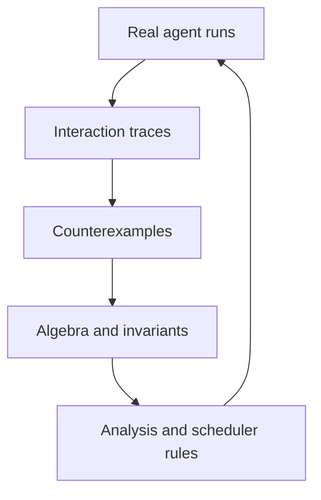

# Research Program

Sources and access limitations are maintained in [the reference index](research/REFERENCES.md).
The [integration record](docs/theory/SCIENTIFIC_INTEGRATION.md) links findings to
current specifications. No performance or novelty claim has been established.

## Central question

> Can we define an effect semantics for autonomous-agent interactions in which schedule confluence is compositional, exchangeable interactions form a meaningful braid structure, and restricted classes satisfy Yang–Baxter-type coherence conditions?

The question is intentionally conditional. A negative or restricted answer is acceptable if it improves the engineering model or prevents invalid claims.

## Research objects

The program studies operation instances, shared state, effect summaries, traces, observation boundaries, schedule transformations, residual operations, and exchange operators. It does not treat free-form model prose as a sufficient mathematical object.

## Initial hypotheses

### H1 — Effect separation predicts safe far commutation

For the deterministic model and complete footprints in the operational semantics,
test the restricted independence theorem separately from effect-extractor coverage.

**Falsifier:** a counterexample satisfying every rule premise refutes the rule;
an omitted relevant effect refutes the extractor's coverage claim.

### H2 — Semantic analysis recovers parallelism lost by syntactic overlap

For a fixed operation class and observation contract, semantic rules may certify
commutation despite syntactic overlap. Invariant preservation alone is insufficient.

**Falsifier:** no meaningful workload class yields additional safe parallelism at acceptable analysis cost.

### H3 — Residualized exchanges compose more coherently than raw swaps

Transforming operations against one another can preserve intent across reorderings in cases where direct swapping fails.

**Falsifier:** within a declared carrier and transformation grammar, a residual
violates admissibility, intent preservation, closure or the stated coherence law.

### H4 — Restricted agent interactions admit braid coherence

For at least one practically useful class of operations, adjacent exchange operators satisfy the braid relation exactly or under named observational equivalence.

**Falsifier:** complete analysis rejects every candidate in a declared finite
transformation search space. This does not refute existence outside that space.
Declare runtime benefit thresholds before searching; known abstract solutions
are controls, not evidence of useful agent exchanges.

### H5 — Algebra-guided scheduling improves the reliability/parallelism frontier

Compared with sequential execution, naive parallel execution, and file-overlap baselines, Agent Braid can recover more parallelism without increasing incorrect outcomes.

**Falsifier:** a preregistered paired evaluation fails its correctness
non-inferiority margin or performance threshold, including analysis/recovery cost.
Until the workload and thresholds are registered, H5 is not experimentally tested.

## Claim ladder

| Claim | Required evidence |
|---|---|
| Two observed runs match | Reproducible trace, named normalizer, state hashes |
| A pair empirically commutes | Multi-state corpus, both orders, failure accounting |
| A syntactic class commutes | Sound static rule and boundary assumptions |
| A transition system is locally confluent | Proof or exhaustive result over a finite specified domain |
| An exchange satisfies a braid relation | Defined carrier/operator/composition and equality or equivalence proof |
| A Yang–Baxter structure exists | Conventional equation, well-typed maps, stated domain, proof, and nontrivial example |

## Experimental method

For each experiment:

1. freeze the initial state and tool versions;
2. enumerate or sample admissible schedules;
3. execute in isolated environments;
4. capture declared and observed effects;
5. normalize outputs using a versioned normalizer;
6. compare observations and quantify uncertainty;
7. minimize divergences into counterexamples;
8. publish fixtures, traces, and evaluation code where safe;
9. label the assurance level explicitly.

## Benchmark families

- disjoint and overlapping text edits;
- AST-aware refactorings across dependent files;
- concurrent package/configuration changes;
- generated artifacts and migrations;
- read-modify-write database operations;
- duplicated and reordered external API calls;
- deployment/configuration races;
- Git worktree integration with clean, textual-conflict, and semantic-conflict cases;
- nondeterministic agents with fixed and variable seeds/models.

## Baselines

At minimum, compare against:

- fully sequential execution;
- naive unconstrained parallel execution;
- file-level overlap;
- line/range overlap;
- Git three-way merge prediction;
- dependency-aware scheduling;
- any directly competing public tool selected for the benchmark.

Competitor names and capabilities must be reverified at experiment time.

## Metrics

- incorrect final-state rate;
- detected and undetected conflict rate;
- safe parallelism and critical-path reduction;
- schedule-space reduction;
- counterexample minimization quality;
- replay success rate;
- analysis and execution overhead;
- false serialization and false commutation rates;
- percentage of operations with complete effect evidence.

## Publication discipline

- Separate peer-reviewed sources, preprints, implementation documentation, and vendor claims.
- Preserve negative results.
- Do not use “formal” for tests or model judgments.
- Publish definitions before headline claims.
- Link each benchmark conclusion to reproducible artifacts and commit hashes.
- State the date of ecosystem comparisons because agent tooling changes rapidly.

## Research-to-runtime loop

The loop is successful only if mathematical refinement produces operational value and operational evidence can falsify or narrow the mathematics.
