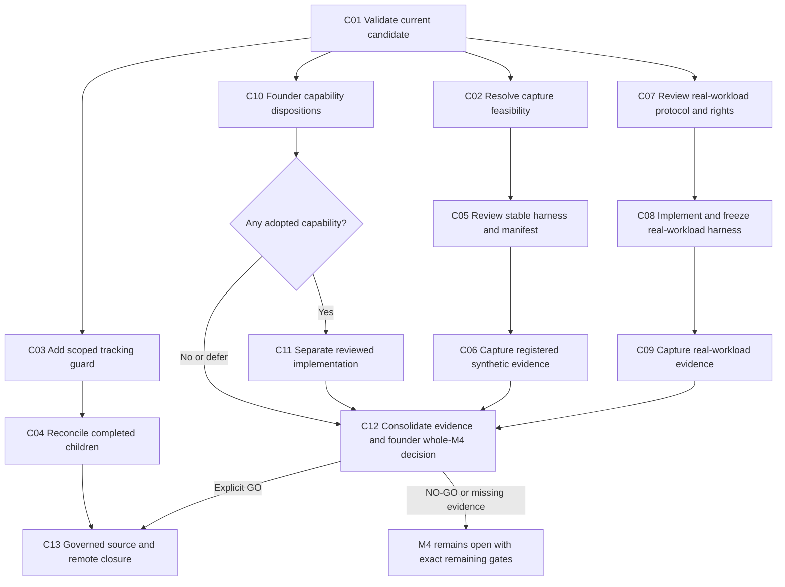

# M4 runtime implementation and closure plan

Status: proposed execution plan; planning complete, implementation and acceptance pending.
Prepared on 2026-10-07 for [M4 — Agent Braid runtime](https://github.com/jayanez/agent-braid/milestone/6).
Baseline: public `develop` at `5cb144e1193a266645e012a7f31224d846ea7003`.

## Goal and completion boundary

Implement and verify every remaining obligation assigned to M4, obtain the explicit capability and whole-M4 decisions, reconcile its tracking, and close milestone **6**. The supported result is a bounded engineering alpha: model-agnostic analysis, verified scheduling, isolated fixed-patch Git execution, observed effects, certificates, recovery, policy and host portability. A closure record must state the exact supported contracts and limits.

This planning request authorizes investigation, parallel planning/review agents and local planning artifacts. It does not itself supply the candidate/manifest-specific approvals required for registered measurements or expanded execution. Those decisions are made against concrete packets at the gates below. No implementation, registered experiment, remote tracking write or milestone closure was performed while preparing this plan.

The implementation phase reaches its goal only when all of the following hold:

1. Every mandatory acceptance scenario has obtained, candidate-bound evidence. The six [SPEC-021 exit rows](../specs/021-m4-alpha-runtime/closure-matrix.md), including their negative controls and supported host/platform boundaries, are reconciled against the final candidate. Changed runtime or transport inputs require fresh affected evidence; historical evidence remains historical.
2. SPEC-022's registered synthetic diagnostic protocol is complete under its approved rules, or a separately reviewed successor protocol resolves an evidenced feasibility failure. A dispatch-budget stop is recorded as incomplete; it is never relabeled as completed capture.
3. Article 19 actual-workload evidence exists for the runtime's declared utility boundary. SPEC-022 synthetic performance and SPEC-013/M2 preparation evidence cannot be relabeled as this evidence. A separate, narrowly scoped real-workload protocol is required unless a source audit finds already-obtained evidence for the exact runtime boundary and the reviewers verify that binding.
4. SPEC-027 has an explicit founder disposition for promotion, code isolation and external effects. Only adopted capabilities enter implementation, each through its own reviewed feature/contract and exact execution authority. An assessment NO-GO/defer can finish its decision task; it does not silently adopt the capability or accept M4.
5. The founder records a **new** exact-candidate G4/whole-M4 GO, after reviewing evidence and supported scope. Positive speedup is not mandatory; a bounded engineering-alpha GO may acknowledge negative utility if the six rows, actual-workload evidence and engineering usefulness support it. The 2026-10-05 NO-GO remains a permanent historical record and remains current until a new decision explicitly supersedes its present disposition.
6. Source tasks, parent states and milestone state reflect those decisions on merged `develop`. Only reviewed M4 operations are applied. A scoped audit is empty, all mandatory M4 issues are closed, milestone 6 is closed, and the private Project is verified or its access limitation is explicitly reported. A merge alone does not meet this criterion.

If evidence is unsafe, infeasible, incomplete or the founder retains NO-GO, report the exact remaining gate and keep M4 open. Finishing a negative research/assessment protocol is a legitimate result; it is distinct from achieving this closure goal.

## Planning method and sources

Applied skills: `planning-and-task-breakdown` (dependency order, small vertical slices, early risk reduction), `speckit-plan` (authorities/design/gates), `speckit-tasks` (stable references/targets/verification), `speckit-analyze` (cross-artifact consistency) and `speckit-converge` (obtained evidence versus remaining acceptance).

This is a cross-spec milestone plan, not a replacement feature spec. Existing `specs/*/tasks.md` and their GitHub issues remain the task list target; the work-package labels below are an execution breakdown of those obligations. There is no second `tasks/todo.md` or duplicate remote backlog. A successor feature gets its next available spec ID and stable tasks only after its scope is reviewed; no new spec number is reserved here.

Read before implementation:

- [Constitution](../CONSTITUTION.md), especially clause zero and Articles 2, 5–7, 9, 12–14, 19–21, 23–25.
- [Governance](../GOVERNANCE.md), [Spec Kit workflow](../docs/development/SPEC_KIT.md), [validation profiles](../docs/development/VALIDATION_PROFILES.md) and [tracking reconciliation](../docs/development/GITHUB_TRACKING.md).
- [Operational semantics](../docs/theory/OPERATIONAL_SEMANTICS.md), [claim discipline](../docs/theory/CLAIM_DISCIPLINE.md), ADRs [0019](../docs/adr/0019-bounded-local-git-runtime.md) and [0020](../docs/adr/0020-bounded-m4-alpha-runtime.md), and the exact versioned runtime schemas referenced by SPEC-020/021.
- Current spec/plan/tasks/assurance and decisions for [SPEC-020](../specs/020-m4-local-git-runtime/spec.md), [SPEC-021](../specs/021-m4-alpha-runtime/spec.md), [SPEC-022](../specs/022-m4-utility-followup/spec.md) and [SPEC-027](../specs/027-runtime-refinement-contracts/spec.md).

The [read-only inventory](evidence/m4-inventory-20261007.json) binds current source hashes, milestone/issue observations and the relevant tracking operations. Two independent planning audits used `gpt-6-luna`, reasoning effort `medium`; their findings inform the plan and do not constitute founder acceptance or new experiment evidence.

## Verified starting state

GitHub currently reports **38 issues: 22 closed, 16 open**. There are no open pull requests at the captured baseline. Four specs are assigned to M4:

| Spec | Current source state | Current GitHub state | Remaining obligation |
| --- | --- | --- | --- |
| SPEC-020 | Bounded private serial Git increment accepted; T001–T007 complete | Parent #191 and children closed | Preserve its contracts and accepted historical evidence |
| SPEC-021 | T001–T014 complete; six-row engineering evidence assembled; G4 usefulness NO-GO | [#204](https://github.com/jayanez/agent-braid/issues/204) open, all 14 children closed | Final utility/evidence interpretation and explicit whole-M4 acceptance; do not reimplement the runtime |
| SPEC-022 | T001–T004 complete; draft whole-feature assurance; registered measurement unexecuted | [#224](https://github.com/jayanez/agent-braid/issues/224) and #225–#230 open | T005 capture/reproduction and T006 decision; reconcile #225–#228 |
| SPEC-027 | T001–T006 complete within synthetic/read-only assessment; human review pending | [#266](https://github.com/jayanez/agent-braid/issues/266) and #267–#273 open | T007 capability decisions; reconcile #267–#272 |

Ten open child issues already have completed source tasks. Once their bounded closure is reviewed and applied, the expected unchanged-scope count is **six open issues**: #204, #224, #229, #230, #266 and #273. This is a planning projection, not an executed tracking update. Completing these issue records still requires the acceptance gates above; they are not six missing runtime implementations.

The full read-only tracking audit reports **70 operations**, of which **14** concern M4: ten child state changes and four SPEC-022 title/text updates. The remaining **56** are outside this goal. The current synchronizer supports full and milestone-title-only scopes, but no M4-only issue/state scope. Its full-plan digest is not authorization to apply a filtered list. Work package M4-C03 provides a small enabling change before any scoped apply while unrelated drift remains.

Existing evidence must be interpreted within its bounds:

- SPEC-021's six pairs had verified tree agreement and median serial/parallel total-wall ratio **0.5581**, favoring serial in that small uncontrolled sample. G4 explicitly remains NO-GO.
- SPEC-022's protocol was approved against public `3777e578ba3f8130d6f284acf54898198a45e0f0`. That decision completes T001 and permits instrumentation/preparation; it explicitly excludes later registered capture, whole-feature review, actual utility and M4 closure.
- T002–T004 instrumentation/harness is present, including reconciled phase accounting, exact immutable trial identities, distinct private destinations, budget observation and safety controls. T003 selected **no optimization**. Do not invent another optimization just to satisfy a delivery checklist.
- The four admitted exploratory diagnostic pairs project **111.17 minutes** for 22 pairs per block against the unchanged **45-minute dispatch budget**. This is a rough linear projection from one pair per block, not a new measurement or prediction guarantee. It is enough to require an explicit feasibility disposition before registered dispatch.
- SPEC-027 has local assessment/refusal controls, installed-backend inventory and abstract failure controls. It has no source promotion, enforced code-execution isolation or real provider adapter. Candidate-bound historical profiles do not approve later edits.

## Priority and dependency graph

Prioritize mandatory closure blockers by dependency centrality and risk of wasting evidence work. No unsupported calendar estimate or numerical business score is invented.

| Priority | Work | Why now |
| --- | --- | --- |
| P0 | M4-C01 current candidate validation; M4-C02 capture feasibility; M4-C07 actual-workload protocol design | Prevent unsafe capture, predictable budget exhaustion and a synthetic-only false closure |
| P1 | M4-C03 scoped synchronization; M4-C10 capability decision packets | Independent work that removes tracking and adoption ambiguity without expanding execution |
| P1 | M4-C05 stable harness/manifest packet | Makes the next required approval concrete and reviewable |
| P2 | M4-C06 registered diagnostics; M4-C08/C09 actual-workload harness/evidence | Obtain missing evidence only after exact gates are met |
| Conditional | M4-C11 adopted capability slices | Implement only capabilities explicitly adopted into M4 closure scope |
| Final | M4-C12 evidence/whole-M4 decision; M4-C13 governed closure | Execute after technical and human dependencies are discharged |



## Ordered execution work packages

These packages are pending future execution. Each retains its existing source task/issue links; new enabling or real-workload work is proposed here and must become reviewed stable tasks before implementation. Acceptance bullets are verification criteria, not completion checkboxes duplicating the tracker.

### M4-C01 — Verify the current merged engineering candidate (P0, M)

**Trace:** SPEC-022 REQ-001–003 / SC-001–003 / T005 [#229](https://github.com/jayanez/agent-braid/issues/229); SPEC-021 REQ-001–008.
**Dependencies:** clean, current public `develop`; passing Spec Kit preflight.
**Owner:** integration lead; independent Luna reviewer for confirmed findings.
**Targets:** `specs/022-m4-utility-followup/assurance.json`, `spec.md`, `quickstart.md`, `stable-harness-review.md` and validation receipt. Existing runtime modules are changed only to fix confirmed regressions, in separately focused slices.

Accept when the quick profile, then one PR profile on a stable candidate pass; focused cost/fixture/trial tests and applicable policy/scheduler/recovery controls are accounted for. Reconcile the current summary that calls all obtained feature evidence empty with the actual obtained engineering/diagnostic evidence; retain that registered measurement is still unexecuted. Update SPEC-027's current quickstart descriptions of now-implemented assessment paths separately if needed, without rewriting frozen records.

**Verification:** the profile commands below; `tests.test_utility_accounting`, `tests.test_m4_utility`, `tests.test_utility_fixtures`, `tests.test_utility_trials`, `tests.test_m4_utility_preparation`, plus selected affected runtime suites. Record actual commands, pass/fail/skips, candidate and environment; do not infer a current pass from previous candidates. A passed profile does not discharge capture or host evidence.

### M4-C02 — Resolve registered-capture feasibility (P0, S)

**Trace:** SPEC-022 REQ-002–004 / SC-002–004 / T005–T006 [#229](https://github.com/jayanez/agent-braid/issues/229), [#230](https://github.com/jayanez/agent-braid/issues/230).
**Dependencies:** C01; existing approved protocol and exploratory cost record.
**Targets:** `stable-harness-review.md`, a new dated feasibility/decision record and prospective successor proposal only if required.

Accept when the packet explains 111.17m versus 45m, setup costs outside the dispatch clock and the disposition of every block. The recommended first action is a feasibility decision, before spending the registered budget.

The existing protocol remains byte-exact. The owner may authorize its 45m bounded run knowing it may stop incomplete, but an incomplete run does not finish the closure evidence obligation. If completion is not feasible, prepare a separate prospective protocol version with justified resource/time/sample bounds and fresh review **before** any changed capture. Do not silently increase time, reduce repetitions, omit a slow block, pool dependency-chain and independent ratios, or reclassify exploratory pairs as registered. Do not perform outcome-guided repeated tuning or weaken grants/verification. If an unchanged-contract improvement is proposed after the completed no-change T003, record a new reviewed decision/candidate rather than rewriting that completed history.

**Verification/evidence:** hash comparison of original protocol/manifest; arithmetic from the captured diagnosis; owner disposition identifies the exact prospective version. No benchmark is executed by this package.

### M4-C03 — Add a digest-bound M4 tracking scope (P1, M)

**Trace:** enabling work for SPEC-022 T006 and SPEC-027 T007; tracking workflow scope boundary.
**Dependencies:** C01; reviewed implementation task for this small tooling change.
**Targets:** `scripts/sync_github_tracking.py`, `tests/test_github_tracking.py`, `docs/development/GITHUB_TRACKING.md`.

Accept when a proposed `--milestone-number 6` mode selects only the registered milestone's specs/tasks and its state operation, binds repository + scope + immutable milestone number + exact operations in the audit digest, and preserves current full/title-only behavior. Unknown/duplicate identities, conflicting scopes, missing/deleted managed records, changed plans and dirty/non-develop apply candidates fail closed. Closing a parent is never inferred from child states. A milestone selection must not create or mutate another milestone's records.

**Verification:** independent Luna review; meaningful tests for exactly the 14 current M4 operations, exclusion of the 56 other operations, digest cross-scope replay rejection, plan drift and idempotent empty re-audit; quick/PR as sensitive validation infrastructure. No remote writes in tests. Until this change is reviewed and merged, the full audit remains read-only; never submit its digest as a narrowly scoped approval.

### M4-C04 — Reconcile already-completed M4 children (P1, S)

**Trace:** SPEC-022 T001–T004 [#225–#228](https://github.com/jayanez/agent-braid/issues/225); SPEC-027 T001–T006 [#267–#272](https://github.com/jayanez/agent-braid/issues/267).
**Dependencies:** C01, merged C03 and reviewed authorization for the exact scoped apply.
**Targets:** scoped audit/apply receipts; M4 issues only.

Accept when the ten completed children and four title/text changes match merged source/evidence, after a fresh scoped audit and reviewed digest. Leave #204/#224/#266, #229/#230/#273 and milestone 6 open. Store before/after issue/milestone state and verify unrelated issues/milestones did not change. Partial apply is followed by a new audit; no blind replay.

**Verification:** `source`, scoped read-only `audit`, guarded `apply` from clean merged `develop`, second scoped audit with `operations: []`; private Project completed-child membership/status checked if access exists. The exact scoped CLI is a proposal until C03 is delivered.

**Checkpoint A:** candidate profiles/review are recorded, capture feasibility has a disposition, and M4 tracking scope is safe. This checkpoint is an evidence boundary, not an extra blanket human approval step.

### M4-C05 — Prepare the exact stable harness/manifest approval packet (P1, M)

**Trace:** SPEC-022 REQ-001–003 / SC-001–003 / T005 [#229](https://github.com/jayanez/agent-braid/issues/229).
**Dependencies:** C01/C02; selected code/diagnostic hashes match a durable public candidate; necessary review/integration completed.
**Targets:** `stable-harness-review.md`, exact registered manifest, preparation receipt, scoped approval record and assurance.

Accept when a clean full clone prepares all prospective identities and distinct private fixture/run/grant destinations without dispatching treatments, pins the full public SHA + exact manifest SHA-256 + protocol version, and includes all nine blocks/five fixed cap exclusions/four numerically eligible blocks. Two warmups + twenty measured pairs per admitted block, alternating order and all invalid/unexecuted rows remain as approved unless a reviewed successor explicitly supersedes those prospective rules. Reuse existing `prepare_m4_utility_trials.py` and the approved library runner; do not invent `--execute` or `--registered` CLI modes that the current CLI refuses.

The packet must name fresh-process control commands, total preparation costs, operational versus observer costs, rights, limits, stop rules and the exact approval scope. Obtain owner approval of this exact packet before registered dispatch. The earlier T001 approval is not this approval. Bind future authority/evidence snapshots correctly; a freeze hash is not approval.

**Verification:** prerequisite checks, manifest/input hash tests, independent Luna medium review and exact owner decision. No registered execution until the matching record exists.

### M4-C06 — Obtain registered synthetic diagnostics and fresh controls (P2, M)

**Trace:** SPEC-022 REQ-001–003 / SC-001–003 / T005 [#229](https://github.com/jayanez/agent-braid/issues/229).
**Dependencies:** C05 approval; approved feasibility disposition and unchanged frozen inputs.
**Targets:** `measurement.json`, raw-record index, fresh reproduction receipt and `assurance.json`.

Accept when the approved runner preserves all intended/attempted/valid/invalid/failed/unexecuted rows, unique identities, verified final trees, source immutability, required disjoint phase/residual accounting and separate observer/preparation costs. Verify fresh-process recovery and duplicate-delivery controls within the exact approved scope. The 45m limit stops dispatch before new treatments; it does not hard-kill an active process. No concurrent benchmark, reproduction or unit suite may contaminate optional child-cost attribution.

Unsafe admission, source mutation, drift, omitted verification or wrong final trees stop the candidate and preserve NO-GO. Budget exhaustion retains incomplete status; no favorable complete-case decision or replacement pair. Bind candidate/environment/protocol/input/output hashes and actual commands. If measurement-bearing inputs change, re-freeze and re-review; evidence-only packaging does not repeat a valid experiment automatically.

**Verification:** independent evidence/manifest validation, source before/after hashes, control outputs and denominator audit. Keep results descriptive synthetic evidence even if a ratio is at least 1.10.

### M4-C07 — Specify real-workload evidence within current runtime contracts (P0, M)

**Trace:** SPEC-021 REQ-008 / G4 and Article 19; SPEC-022 REQ-004 / SC-004 / T006 [#230](https://github.com/jayanez/agent-braid/issues/230).
**Dependencies:** C01; independent of C02–C06 and M3/M3.5.
**Targets:** successor feature `spec.md`, `assurance.json`, `research.md`, source/rights manifest and proposed protocol; allocate the next available spec ID during authorized specification work.

Accept when one permissioned **real** repository workload has explicit relevance, authorship/source rights, provenance, common base and exact 2–4 immutable ordinary-text A/M operations. All operations remain inside current fixed-patch grants: no arbitrary code/test/hook execution, source ref promotion, network/provider calls or new host. SPEC-013's real workstream may inform a source proposal, but its accepted M2 preparation/test evidence and approval do not cover M4 execution or costs.

Pre-register baseline, serial/runtime treatments, denominator, order, measured costs, refusal/conflict/dependency expectations, recovery controls, budgets, missingness and stop rules. Include the full input/replay/preparation/grant/execution/verification/cleanup boundary. Owner source rights and exact protocol approval precede implementation/capture at their applicable gates. Document unavailable sources as infeasible; do not manufacture a real workload from synthetic text or depend on M3.5 predictor data.

**Verification:** Spec Kit specify/plan/tasks/analyze with stable requirements/scenarios/tasks and authority snapshots; independent Luna medium review. The successor remains pending if rights/yield/domain cannot be established. No change to Article 19 or the approved SPEC-022 synthetic protocol is proposed.

### M4-C08 — Implement only the missing real-workload harness slice (P2, M)

**Trace:** reviewed successor requirements from C07; SPEC-021 six-row safety boundary.
**Dependencies:** C07 protocol/architecture approval and source feasibility.
**Targets:** one new narrow runner, its focused test module, successor `plan.md`, `tasks.md` and `quickstart.md`. Reuse existing accounting/runtime consumers without extending grants or public semantics.

Accept when the workload can pass through the current serial/runtime treatments with immutable manifests, private destinations, exact grants, independent verification and explicit failure/cost recording. Malformed/stale/unknown inputs, missing authority, unsafe effects and incorrect tree results are refused. If reuse requires changing a public contract, separate that ADR/schema migration before implementation.

**Verification:** focused tests for actual novel invariants, existing affected runtime controls, quick profile during increments, one PR profile on the stable candidate and independent Luna medium review. Merge/freeze under its applicable authority, then prepare a separate exact stable harness/manifest approval; implementation approval is not capture approval.

### M4-C09 — Capture actual-workload evidence (P2, M)

**Trace:** successor tasks; SPEC-021 G4/Article 19; SPEC-022 T006 utility interpretation.
**Dependencies:** C08 frozen candidate, source rights and matching exact capture approval.
**Targets:** raw observation index, environment/candidate receipt, scenario evidence and bounded result packet.

Accept when all registered outcomes are retained, verified results/effects and refusals/recovery are reported, and total costs/observed overlap/diagnostic usefulness are evaluated under the declared real-workload boundary. Results may be negative; report limitations and missing/invalid outcomes. Fresh affected Darwin/Linux or actual-host evidence is captured only where the final runtime/transport change invalidates the earlier coverage; do not rerun host sessions merely because evidence was packaged.

**Verification:** clean-process reproduction as specified separately, independent evidence review and full denominator/source-integrity audit. A simulator, test pass or retrospective M2 receipt cannot discharge this gate. Infeasible/incomplete evidence leaves the closure goal pending.

**Checkpoint B:** synthetic and actual-workload strands each have their own approved protocol, candidate, raw outcomes and interpretation. No result has been converted into adoption or M4 acceptance.

### M4-C10 — Obtain capability dispositions for SPEC-027 (P1, S)

**Trace:** SPEC-027 REQ-005 / SC-005 / T007 [#273](https://github.com/jayanez/agent-braid/issues/273).
**Dependencies:** current T006 evidence; C01 authority/input drift review. Runs in parallel with utility work.
**Targets:** capability decision record, `decision-packets.md`, `assurance.json`, `tasks.md` and current roadmap summary.

Accept when the founder explicitly adopts, refuses or defers each capability, with evidence, restrictions, fallback and reconsideration trigger. Present concrete existing dispositions: promotion lacks consumer/grant/exclusive-CAS enforcement (fallback export/manual integration); code isolation enforcement is unverified and zero probes have run (fallback analysis/private fixed-patch replay); external effects have only abstract simulations and no rights/provider adapter (fallback simulation/abstention on ambiguous success).

Recommend recording current unsupported capabilities as NO-GO/deferred unless an exact separately reviewed implementation cut is selected. This keeps assessment closure honest; it does not bypass whole-M4 acceptance. Distinguish adopted-for-future-track from adopted-into-this-M4-exit scope. Only the latter must be fully implemented before this goal can close. The founder's scope decision is explicit, not an agent reassignment of open work.

**Verification:** exact candidate/evidence decision record, Spec Kit binding/source validation, existing nine refusal/failure assessment controls as needed after changes. T007 finishes only against the actual decision, not preparation of another packet.

### M4-C11 — Implement adopted capability slices, if selected (conditional, separate S/M tasks)

**Trace:** C10 adopted contract and successor spec IDs allocated later.
**Dependencies:** capability-specific ADR/contract adoption, owner implementation scope, exact operation/probe authority, resources/rights and frozen candidate as applicable.

Do not batch these into one expansion or silently treat them as current SPEC-027 implementation tasks:

| Capability | First reviewed implementation slice | Mandatory verification | Current fallback |
| --- | --- | --- | --- |
| Source promotion | Promotion-specific grant and independently verified proposal; then separate exclusive validation/CAS/recovery slice | stale/dirty/attached/locked/prunable/missing/unknown target refusal; race/fault/recovery controls; legacy grants cannot promote | export/manual integration |
| Code checks | Read-only backend feasibility followed by exact harmless probes if approved; only then code-check contract/harness | credentials/filesystem/network/descendant/memory enforcement demonstrated; bounded resource exhaustion and cleanup; install separately authorized | analysis/private fixed-patch replay |
| External effects | One adapter's request/result/failure/rights contract, followed by dry-run then separately granted operation | duplicate delivery, ambiguous success, retries, partial effects and non-inverse compensation retained; no automatic resend under uncertainty | abstract simulation |

Each selected slice gets stable requirements/scenarios/tasks, at most 3–5 production/test/doc target files per implementation increment, quick/PR and independent Luna medium review, candidate-bound evidence and a separate acceptance decision. Exact filenames/backends/providers are resolved in that approved feature, not invented here. New services, credentials, paid calls or backend installations need their actual applicable authority. If no capability is adopted into M4, C11 is explicitly not applicable with the recorded C10 decisions, not a falsely passed test.

SPEC-024 is an optional source of abstract failure fixtures; SPEC-027 already permits standalone controls. LAB.1, RES.1, ADP.1, System 1 and forecast milestones are not prerequisites to this bounded goal.

### M4-C12 — Consolidate evidence and obtain whole-M4 decision (final, M)

**Trace:** SPEC-022 REQ-004 / SC-004 / T006 [#230](https://github.com/jayanez/agent-braid/issues/230); SPEC-021 [#204](https://github.com/jayanez/agent-braid/issues/204); SPEC-027 decision scope.
**Dependencies:** C06 protocol evidence, C09 actual-workload evidence, C10 dispositions and any adopted C11 mandatory capabilities.
**Targets:** SPEC-022 `decision-packet.md`, updated six-row M4 closure matrix, new dated founder M4 decision, final assurance/reconciliation receipt. Preserve all earlier reviews/NO-GO records verbatim.

Accept when an independent Luna medium review reconciles requirements → scenarios → controls → raw evidence → reviewed candidate for all six rows and the final capability scope. Record zero unsafe admissions, refusals, verified agreement, replayability, observed worker overlap (not inferred CPU parallelism), diagnostic usefulness, costs, host/platform limits and the actual workload interpretation. State exactly which final inputs retain historical evidence and which needed fresh checks.

Negative performance can be reported with demonstrated engineering usefulness and limits; do not claim speedup/general concurrency safety/scientific validation. Prepare the explicit whole-M4 GO/NO-GO decision against a frozen clean public candidate and authority/evidence hashes. Approval requires the real owner decision; hashes, agent review and issue closure do not supply it. Any requested publication/release remains a separate decision.

**Verification:** one stable-candidate PR profile after final technical changes, separately required reproductions, exact-input evidence checks, independent review with findings resolved, founder record. Record any infrastructure-not-executed checks as unexecuted; a conditional skip remains skipped. NO-GO keeps the parent/milestone open and produces a precise continuation queue.

### M4-C13 — Integrate closure records and close scoped tracking (final, S)

**Trace:** SPEC-021 #204, SPEC-022 #224/#229/#230, SPEC-027 #266/#273 and any approved M4 successor tasks.
**Dependencies:** C12 explicit GO, completed approved mandatory successors, merged source states, reviewed PR/integration authority and fresh scoped tracking digest.
**Targets:** `ROADMAP.md`, `docs/development/github-tracking.json`, affected current task/assurance summaries and closure/apply receipt. Historical records retain actual models, dates and states.

Accept when merged source records reflect supported scope, every mandatory child has actual completion evidence, explicitly recorded parent closures and milestone 6 closure. Re-run read-only source/audit on clean current `develop`; review and authorize the exact M4-only operations; apply the matching digest; verify milestone number/title/associations, before/after states and `operations: []`. Preserve all 56 out-of-scope baseline operations for their owners and verify no unrelated remote changes.

Check private Project membership and its custom Review pending/Done states separately; source audit does not authenticate private Project status. If that access is unavailable, record the remaining Project verification instead of claiming it ran. Close the implementation goal only when its mandatory closure criteria are actually achieved. Do not publish a release or change other milestones as a by-product.

**Checkpoint C:** public merged source, exact founder decision, scoped remote truth and supported claims agree. M4 is closed with all limitations visible.

## Parallel agent ownership

All delegated planning, implementation and review agents use **Luna Latest (`gpt-6-luna`), effort `medium`**, as requested. The main integration session retains its model. If Luna is unavailable, report that limitation; do not substitute another review model. Maximum concurrency here is the lead plus three agents.

| Lane | Exclusive responsibility | Safe parallel work |
| --- | --- | --- |
| Lead | shared runtime/policy changes, merge/freeze, assurance coordination and exact authority decisions | integrate completed independent slices sequentially |
| Utility agent | SPEC-022 packet/harness/evidence; later reviewed actual-workload runner | C02/C05 while tracking agent develops C03; C07 drafting can run independently |
| Tracking agent | synchronizer, its tests and tracking documentation only | C03 before capture, C04 after reviewed merge/apply gate |
| Refinement agent / reviewer | SPEC-027 decisions/drafts; later independent review of other lane output | C10 while utility work proceeds; read-only convergence review |

For implementation delegation, explicitly assign files, state that the agent is not alone in the codebase, and require accommodating other edits. Two writers do not share assurance/roadmap/tracking files: the lead packages those changes. Reviewers remain read-only and do not review their own implementation. Pause independent work when a shared contract changes. Registered performance capture and CPU-sensitive reproduction run alone; stop or finish other local tests first. More agents do not provide evidence of safe runtime parallelism.

## Validation commands and gate order

Use Python 3.12+ in an isolated environment, with that environment's `bin` first in `PATH` for child interpreters. Refresh current `origin/develop` at execution start; verify input/authority drift and do not overwrite existing user changes.

```sh
export PATH="$PWD/.venv-speckit/bin:$PATH"
python scripts/validate_spec_kit.py
python scripts/validate_change.py --base develop --profile quick
python scripts/validate_change.py --base develop --profile pr
python scripts/sync_github_tracking.py source
python scripts/sync_github_tracking.py audit
```

Quick is per coherent implementation increment; PR is once per stable candidate, repeated only after relevant changes/failures. Sensitive or unknown paths may escalate. The full audit is read-only. M4-scoped audit/apply commands are supplied by C03 only after that reviewed change exists. Do not use `--milestone-titles-only` for issue or state reconciliation.

For a reviewed new/changed feature, the applicable Spec Kit steps additionally use explicit feature selection, authority snapshot before review and freeze at a clean candidate:

```sh
SPECIFY_FEATURE_DIRECTORY=specs/<reviewed-feature> python .specify/scripts/python/check_prerequisites.py --json --require-tasks --include-tasks
python scripts/validate_spec_kit.py snapshot specs/<reviewed-feature>
python scripts/validate_spec_kit.py freeze specs/<reviewed-feature>
```

Do not refresh historical hashes or reset a current approval to conceal authority drift. Snapshotting records bytes and resets review to pending; it never approves a feature. Capture commands are the exact commands in their subsequently reviewed packets, not assumed CLI examples. Clean-room reproduction, registered measurement, actual-host exercise, human review, founder acceptance and remote apply remain separate gates.

## Risks, stop gates and current decisions

| Risk | Required action / continuation |
| --- | --- |
| Estimated capture duration exceeds dispatch budget | C02 feasibility decision; unchanged bounded incomplete run or separately reviewed prospective successor; no silent cap/repetition edits |
| Synthetic-only utility evidence | C07–C09 permissioned real-workload strand; never repurpose M2 evidence or claim Article 19 discharge |
| Safety or identity failure | stop new treatments, preserve raw state, diagnose/fix in focused slice, re-freeze/review if inputs changed |
| Source rights/yield unavailable | record infeasibility; keep G4/M4 open; continue independent tracking/capability packet work |
| Expanded capability lacks enforced contract | NO-GO/fallback; implement only a separately adopted scope with specific authority |
| Full tracking tool would mutate unrelated work | C03 scope/digest guard; no full apply under an M4-only goal |
| Authority or candidate drift | report exact differences and get required fresh review; do not refresh bytes as substitute approval |
| Hosted/host/platform control cannot execute | distinguish pending/unexecuted/skipped from failed/passed; preserve the actual row limitation |
| Negative utility | legitimate disclosed result; founder separately decides bounded engineering-alpha merit; no automatic closure |

The next execution checkpoint is **C01 + C02 + C03 + C07/C10 packet preparation**. It produces verified candidate controls and concrete decisions before expensive capture or expansion. No additional dependency on M3/M3.5, predictor training, forecast models, arbitrary-code execution or external services is introduced.

## Planning validation and recovery

The original shared worktree preflight failed with `public repository contains unreachable objects`; no history was pruned or rewritten. Planning continued in a fresh full public clone with Python 3.13.11 in `.venv-speckit`, pinned isolated dependencies and the documented SPEC-012 candidate restoration. The complete Spec Kit structural preflight passed; its semantic/human-review limit remains explicit. Existing feature plans were discovered with `setup_plan.py --json` (template copying skipped); prerequisites passed for SPEC-021/022/027 without changing those plans.

The tracking `source` check passed (37 specs, 287 tasks, 18 milestones). The read-only full audit exited 1 because of its 70 reconciliation operations; this is tracking drift, not a successfully empty audit. Runtime tests, registered capture, new reproductions, owner decisions, pushes/merges and remote writes were not performed for this planning request. Planning-artifact checks and independent final plan review are recorded in the accompanying receipts.
